# HRMS_client

This document includes all the mobile application code. Everything is easily to understand if you are familiar with the flutter. Specially, I hope my project is kindly helpful to you.

## Features

* [Service.dart](lib/Service.dart) shows all the available services in the programs by using get_it.
```dart
class Service {
  // 打电话服务 Telephone service
  void call(String number) => launch("tel:$number");
  // 发短信服务 SMS service
  void sendSms(String number) => launch("sms:$number");
  // 发邮件服务 Email service
  void sendEmail(String email) => launch("mailto:$email");
  // 员工api Emplpyee web API
  API$Employee getEmployeeAPI() => API$Employee();
  // 职位api Post web API
  API$Post getPostAPI() => API$Post();
  // 部门api Department web API
  API$Department getDepartmentAPI() => API$Department();
  // 考勤api Attendance web API
  API$Attendance getAttendanceAPI() => API$Attendance();
  // 工资api Salary web API
  API$Salary getSalaryAPI() => API$Salary();
}
```
* [All the constants](./lib/Constants.dart) are contained here.
```dart
...
  // 后台返回状态 成功 request success
  static final int STATUS_SUCCESS = 0;
  // 后台返回状态 失败 request failure
  static final int STATUS_FAILURE = 1;
...
```
* [All the pages](./lib/pages) are contained here.
* [All the widgets](./lib/widgets) are contained here.
* [All the network files](./lib/api) are contained here.
* [All the events](./lib/events) are contained here, which is supported by event_bus and able to curry the data the page needed.
* [All the beans](./lib/models) are contained here. All the beans should implement [IBean.dart](.lib/models/IBean.dart) that represents the data format the page needed. [IModel.dart](./lib/models/IModel.dart) represents the basic web interface format we predefined.
```json
//Basic web interface format
//1.Integer status : 0 success / 1 failure
//2.String msg : error message
//3.JsonArray data : fetching data when success (default:"[]")
//4.String code : error code
//EXAMPLE
{"status" : 0, "msg" : "请求成功", "data":[]}
{"status" : 1, "msg" : "密码错误", "code":"CE00003"}
```
```dart
abstract class IBean {
  fromJson(Map<String, dynamic> json);
}

class IModel {
  
  int status;
  String msg;
  String code;

  IModel(int status, String msg, String code)
      : this.status = status,
        this.msg = msg,
        this.code = code;

  IModel.fromJson(Map<String, dynamic> json) {
    status = json['status'];
    code = json['code'];
    msg = json['msg'];
  }
}
```


## ScreenShots
<div>
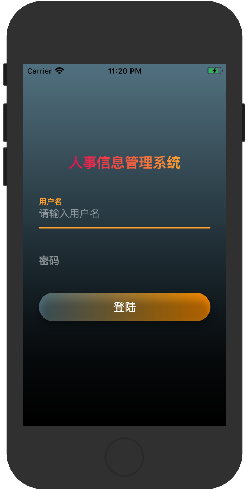
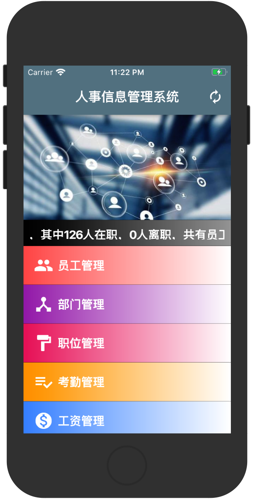
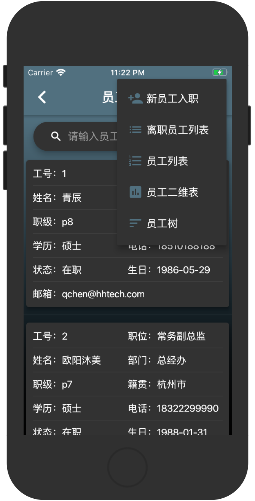
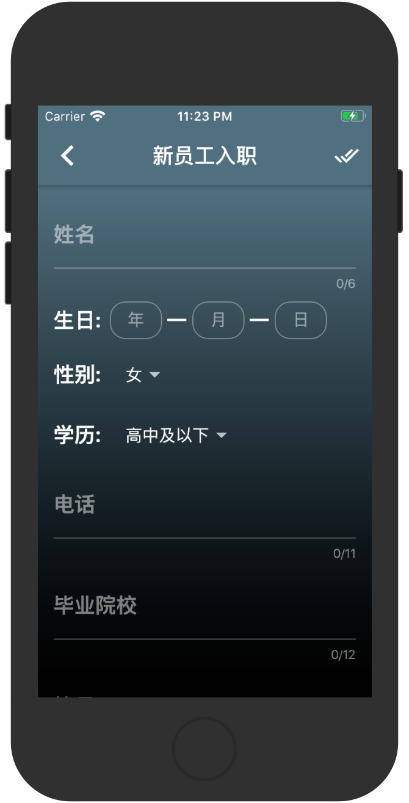
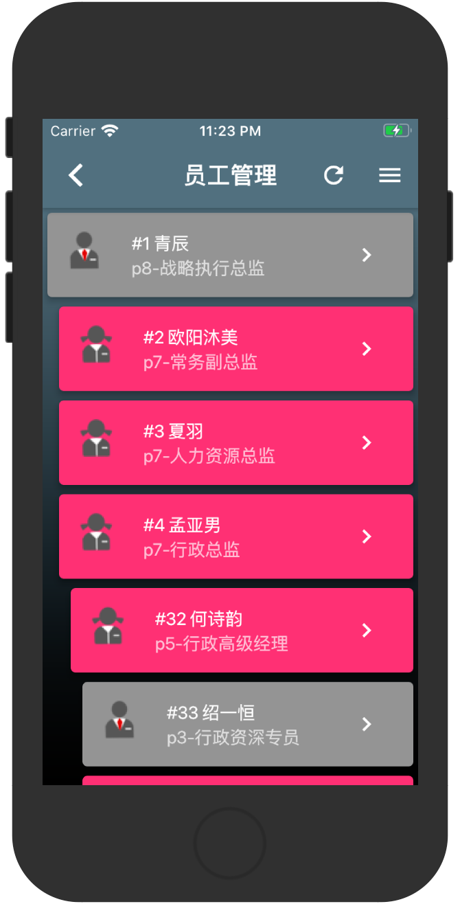
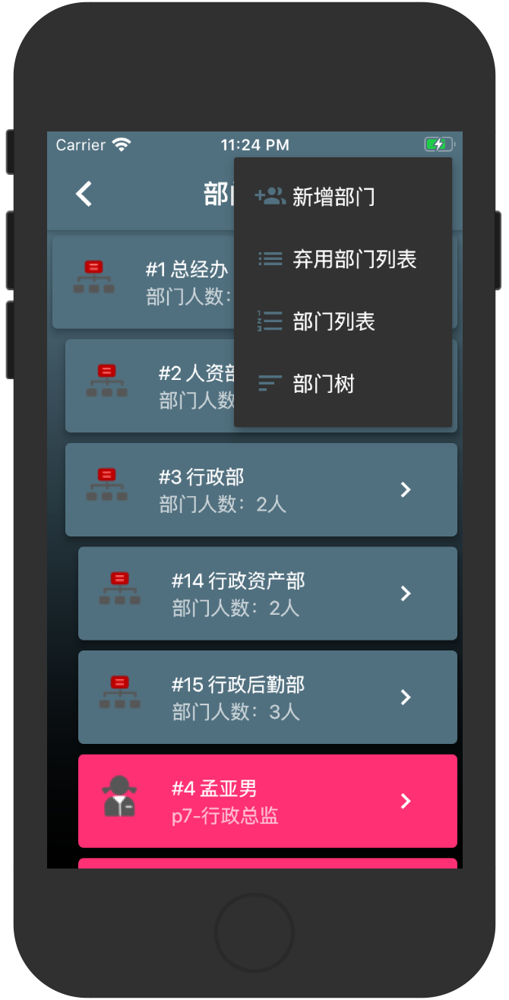
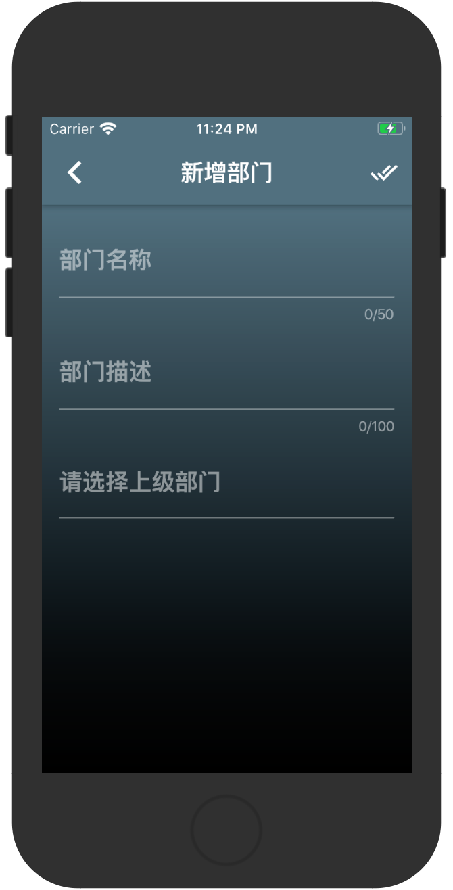
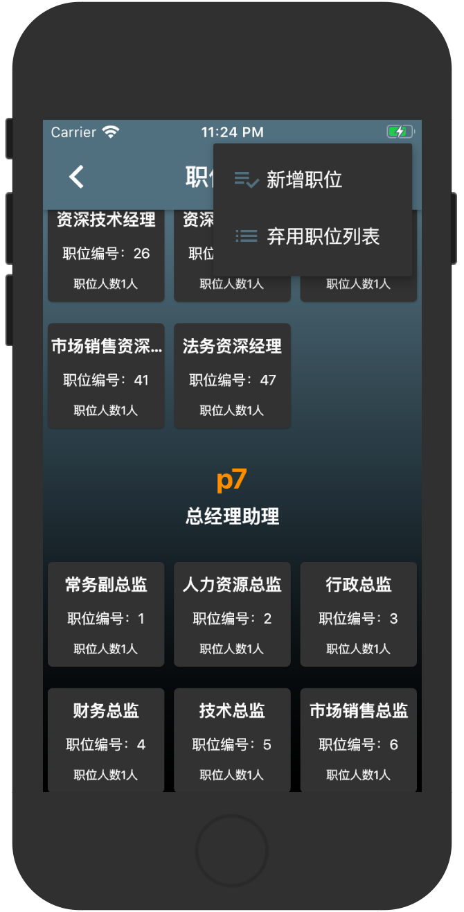
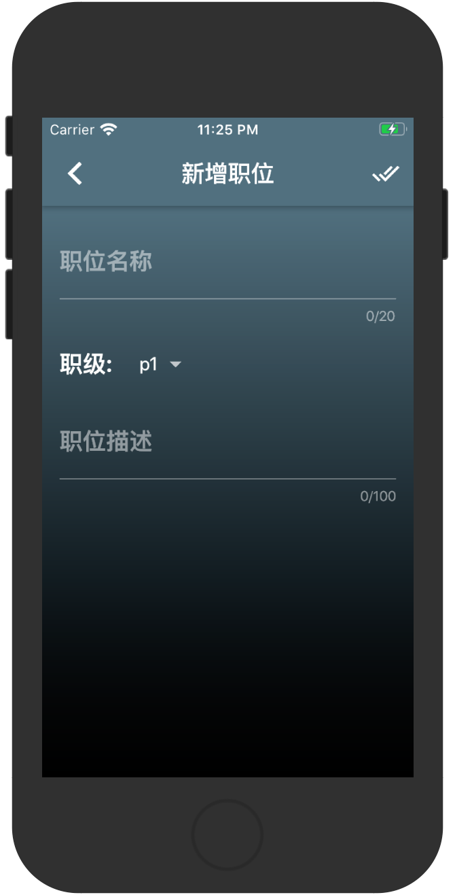
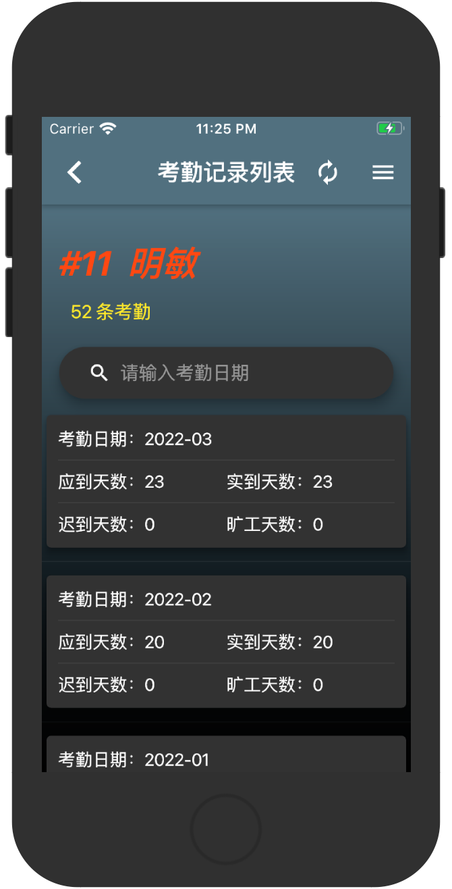
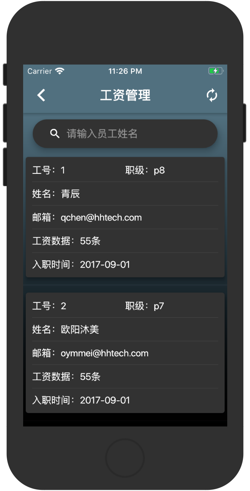
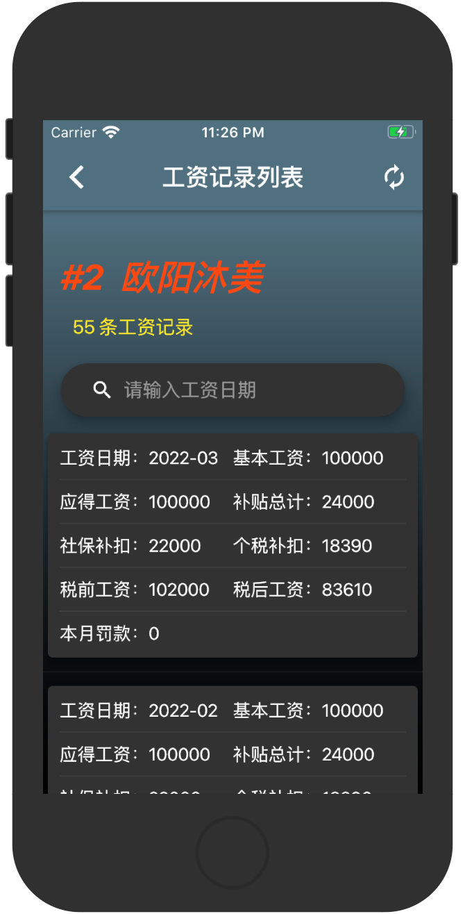
</div>

## RUN

Acquire more information about flutter, please see [this document](https://flutter.io/)

#### 1. [flutter configuration](https://flutter.io/setup/)

#### 2. run APP

```sh
$ flutter run
```